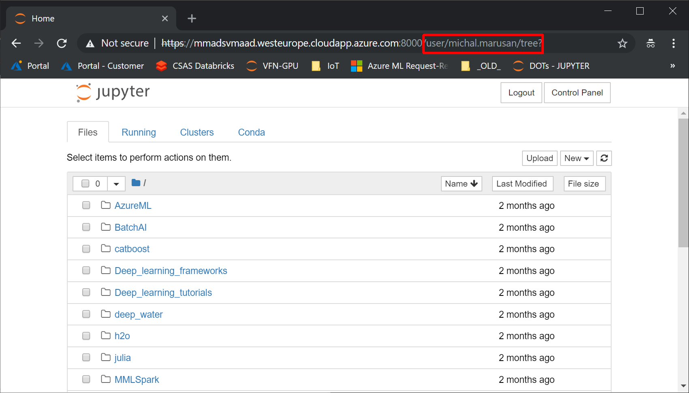
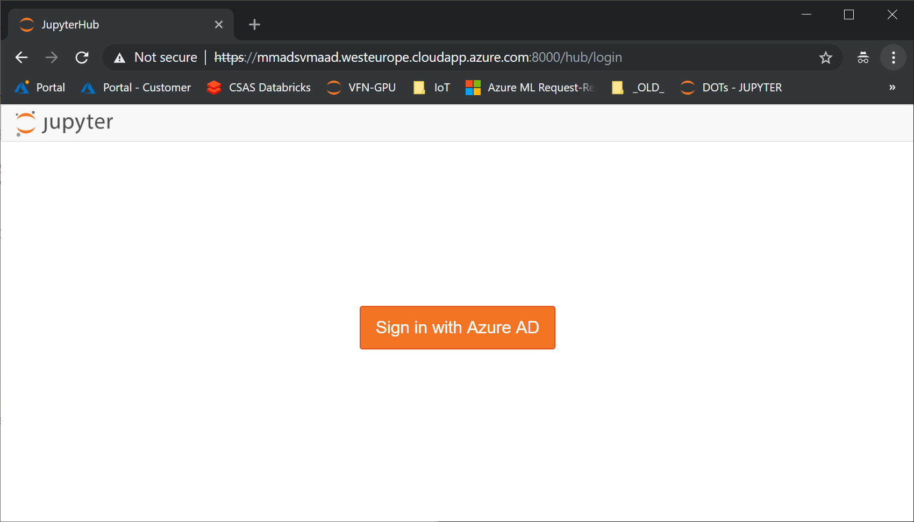

# Create DSVM (Linux) with AAD and Authenticate with AAD to JupyterHub

Simple guide on how to enable Azure Active Directory (AAD) integration with LInux DSVM and using JupyterHub.

## Motivation

Many requests to simplify loging into JupyterHub in DSVM.

## Prerequisities


### Step 0
Create a DSVM - in your Azure subscription create Data Science Virtual Machine for Linux.

### Step 1
Apply extension to allow AAD login to VM (https://docs.microsoft.com/en-us/azure/virtual-machines/linux/login-using-aad#install-the-azure-ad-login-vm-extension)

```
az vm extension set \
    --publisher Microsoft.Azure.ActiveDirectory.LinuxSSH \
    --name AADLoginForLinux \
    --resource-group YOUR_RESOURCE_GROUP \
    --vm-name YOUR_VM_NAME
```

Setup JupyterHub AAD Login - according to https://github.com/jupyterhub/oauthenticator#azure-setup
1. Install oauthenticator
2. Export env variable AAD tenant id
3. Create AAD App - return URL must match 
4. Change jupyterhub_config.py - use oathenticator (domain here is the address of VM


With data setting I was not able to login via my AAD login. I needed to make additional configuration:
1. Alter jupyterhub_config.py - add SudoSpawner (`https://github.com/jupyterhub/jupyterhub/issues/1527`) for admin at the VM
    ```
    c.JupyterHub.spawner_class = 'sudospawner.SudoSpawner'
    c.Spawner.cmd = '/home/admin_account/.local/bin/sudospawner'
    ```
2. User must login to VM with AAD first - it will create user profile folder in /home
The name on the User AD Record is the one, which is used as profile to JupyterHub


3. I needed to create Linux user to match the AAD user name (without @abc.com)


4. I needed to CHOWN notebooks directory to linux User

Result:


